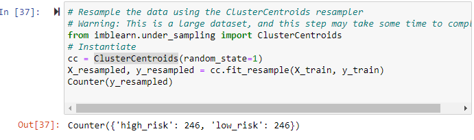

# Credit_Risk_Analysis
## Overview
In this project we use Python to build various machine learning models to evaluate and predict credit risk. 
Following are the various models we used to compare the accuracy scores the evalute the right model for this kind of data.
* Oversampling the data using **RandomOverSampler** and SMOTE algorithm
* Undersampling the data using **ClusterCentroids** algorithm
* Over & Undersampling using **SMOTEENN** algorithm
* Camparing 2 models that reduce bias, **BalancedRandomForestClassifier** and **EasyEnsembleClassifier**

We will also review the performance of each model and make a recommendation on which model would best fit for predicting credit risk analysis

## Resources
* CSV data file - LoanStats_2019Q1.csv
* Python 3.7.9, mlenv Virtual python environment using Anoconda
* Jupyter Notebook as the IDE

## Results

### *RandomOverSampler Model*

This model shows very low precision on **High Risk** accuracy score with a 75% **Sensitivity** and 100% **Low Risk** precision, hence this model is not a recommended and would need to evaluate other models to reach default accuracy rate.

### *SMOTE Model*

This model shows very low precision on **High Risk** accuracy score with a 62% **Sensitivity** and 100% **Low Risk** precision, hence this model is not a recommended and would need to evaluate other models to reach default accuracy rate.

### *ClusterCentroid Model*

This model shows very low precision on **High Risk** accuracy score with a 69% **Sensitivity** and 100% **Low Risk** precision, hence this model is not a recommended and would need to evaluate other models to reach default accuracy rate.

### *SMOTEENN Model*
This model shows very low precision on **High Risk** accuracy score with a 70% **Sensitivity** and 100% **Low Risk** precision, hence this model is not a recommended and would need to evaluate other models to reach default accuracy rate.

### *BalncedRandomForestClassfier Model*

This model shows very low precision on **High Risk** accuracy score with a 67% **Sensitivity** and 100% **Low Risk** precision, hence this model is not a recommended and would need to evaluate other models to reach default accuracy rate. This model does have a slightly higer **High Risk** recision when compared to previous model still not recommended as the prediction rate is very low compared to **Low Risk** precision score.

### *EasyEnsembleClassifier Model*

This model shows very low precision on **High Risk** accuracy score with a 91% **Sensitivity** and 100% **Low Risk** precision. When compared to all other models this model has the higest **Sensivity** accuracy on high risk. The fact that the **Low Risk** accuracy precision scote is only 7% I woudl not recomment this model as a good model for this analysis.

## Summary

* Overall all models used to predict credit risks shows weak precision in determining the **High Risk** precision
* As discussed in the results, the **Ensemble** model brought the highest **Sensivity/Recall** rate of 91% and detected almost all as high risk credit. On the other hand with the low risk precision of 100% many records are falsely detected and is not providing the needed accuracy score to help the bank analyze the credit strategy.
* For the above reasons I do not recomment any of the models to predct the credit risk
* Finally, the SMOTTEEN and Ensembler models did show higher performance impact and hence was not a good model to use for this data analysis.
